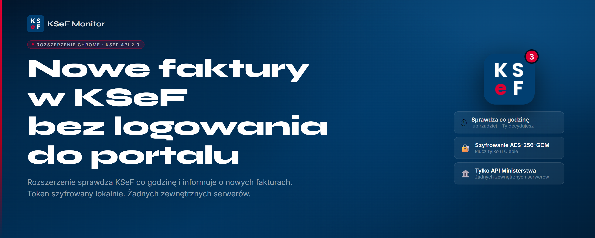
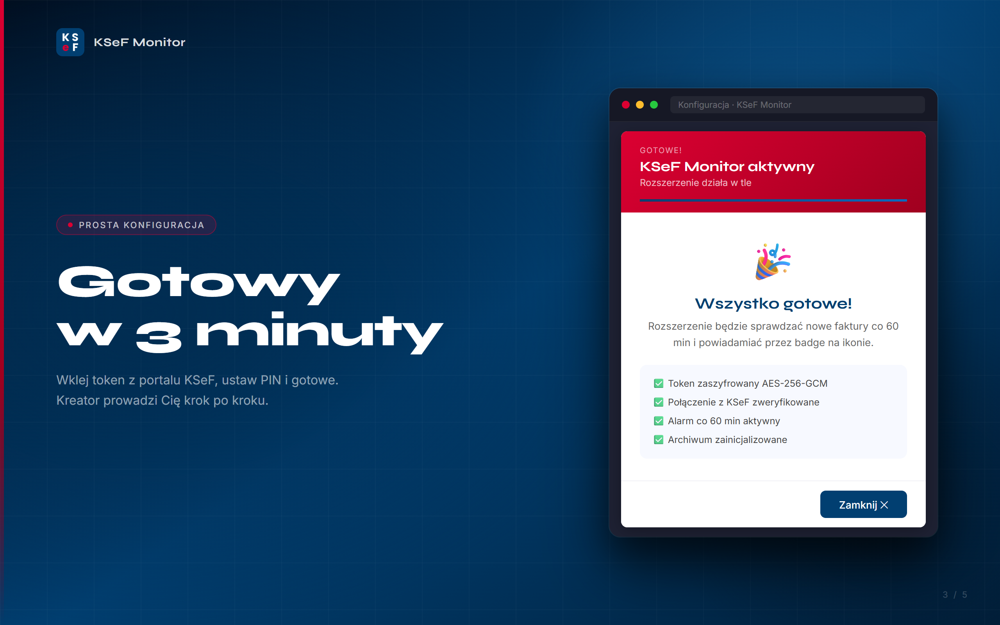
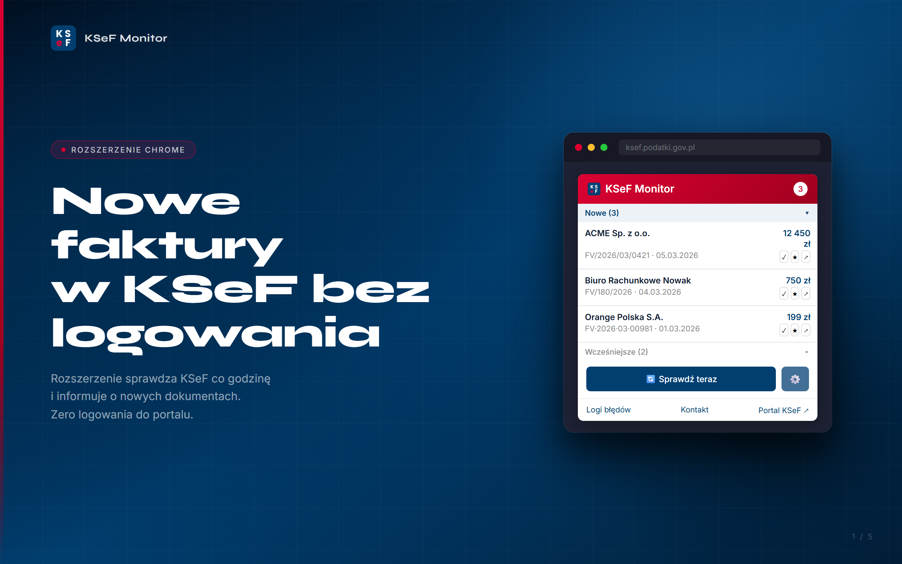
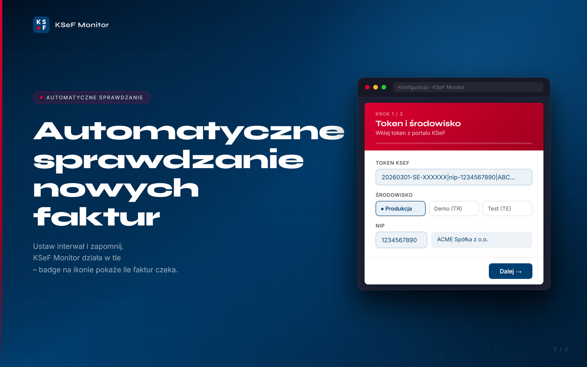
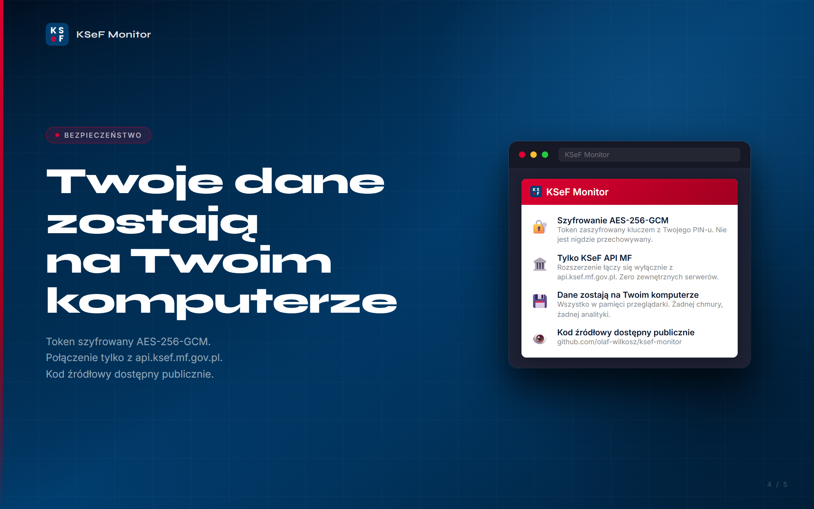

# KSeF Monitor

   

Rozszerzenie przeglądarki, które monitoruje nowe faktury zakupowe w Krajowym Systemie e-Faktur i powiadamia Cię gdy pojawi się coś nowego – bez logowania do portalu.

 

---

## Co robi

- Sprawdza KSeF w tle co godzinę (lub rzadziej – do wyboru)
- Pokazuje liczbę nieprzejrzanych faktur na ikonie w pasku przeglądarki
- Wyświetla listę nowych faktur z nazwą wystawcy, numerem i kwotą
- Wysyła powiadomienie push gdy przyjdzie nowa faktura (opcjonalnie)
- Obsługuje **wiele NIP-ów** – przełączaj między działalnościami jednym kliknięciem

 

---

## Wymagania

- Przeglądarka Chrome, Edge lub Brave (wersja 88+) albo Firefox (wersja 140+)
- Token KSeF z uprawnieniem **„przeglądanie faktur"** – wygenerujesz go w [portalu KSeF](https://ksef.podatki.gov.pl) w zakładce _Zarządzaj tokenami_

---

## Instalacja

### Ze sklepu Chrome Web Store

Kliknij **Dodaj do Chrome** na [stronie rozszerzenia](https://chromewebstore.google.com/detail/ksef-monitor/adfieckbhbajegaomloplmkiimcgamgk).

### Firefox Add-ons (AMO)

Kliknij **Dodaj do Firefox** na [stronie rozszerzenia](https://addons.mozilla.org/pl/firefox/addon/ksef-monitor/).

### Ręcznie (tryb deweloperski)

1. Pobierz i rozpakuj archiwum ZIP z rozszerzeniem
2. Otwórz `chrome://extensions` w przeglądarce
3. Włącz **Tryb dewelopera** (przełącznik w prawym górnym rogu)
4. Kliknij **Załaduj rozpakowane** i wskaż folder `extension/`
5. Ikona KSeF Monitor pojawi się w pasku – kliknij ją i przejdź przez konfigurację

---

## Pierwsze uruchomienie

Po kliknięciu ikony pojawi się kreator w 3 krokach:

**Krok 1 – Token**
Wklej token KSeF skopiowany z portalu. NIP i nazwa firmy zostaną odczytane automatycznie.

**Krok 2 – PIN**
Ustaw PIN – to hasło, którym rozszerzenie szyfruje token lokalnie. Zapamiętaj go, bo będzie potrzebny przy ponownym uruchomieniu przeglądarki.

**Krok 3 – Test połączenia**
Rozszerzenie sprawdza czy token działa i pobiera listę ostatnich faktur jako punkt wyjścia.

 

---

## Codzienne użycie

   

**Ikona w pasku** pokazuje liczbę faktur wymagających uwagi. Kliknij ją by otworzyć listę.

**Lista faktur** jest podzielona na dwie sekcje:

- **Nowe** – faktury młodsze niż wybrany próg, pogrubione
- **Wcześniejsze** – starsze faktury zachowane jako kontekst

**Akcje na fakturze:**

- `✓` – oznacz jako przejrzaną (znika z licznika)
- `★` – przenieś z powrotem do nowych
- `✕` – ukryj z listy
- `↗` – otwórz portal KSeF

Po oznaczeniu możesz cofnąć akcję przez **Cofnij** (masz 4 sekundy).

**Sprawdź teraz** – wymusza natychmiastowe pobranie faktur poza harmonogramem.

### Wiele NIP-ów

Jeśli prowadzisz kilka działalności, możesz dodać tokeny dla każdego NIP-u. Przełącznik w głównym widoku pozwala błyskawicznie zmieniać kontekst. Każdy NIP ma niezależne faktury i historię, a jeden PIN zabezpiecza wszystkie tokeny.

---

## Ustawienia

Otwórz rozszerzenie → ikona ⚙️ w prawym górnym rogu.

  

| Ustawienie           | Opis                                                        |
| -------------------- | ----------------------------------------------------------- |
| Podpięte NIP-y       | Lista kont; edycja nazwy firmy, dodawanie i usuwanie NIP-ów |
| Interwał sprawdzania | Co ile godzin rozszerzenie odpytuje KSeF (min. 1h)          |
| Nowe przez ostatnie  | Faktury młodsze niż X dni trafiają do sekcji „Nowe"         |
| Powiadomienia push   | Czy pokazywać powiadomienie systemowe przy nowej fakturze   |
| Odśwież archiwum     | Pobiera faktury od nowa (np. po przerwie)                   |

---

## Bezpieczeństwo

   

Token KSeF jest **szyfrowany lokalnie** algorytmem AES-256-GCM. Klucz szyfrowania pochodzi z Twojego PIN-u – rozszerzenie nigdy go nie przechowuje. Bez znajomości PIN-u zaszyfrowany token jest bezużyteczny.

Rozszerzenie komunikuje się wyłącznie z `api.ksef.mf.gov.pl`. Żadne dane nie są wysyłane do zewnętrznych serwerów.

---

## Często zadawane pytania

**Czy muszę być cały czas zalogowany do portalu KSeF?**
Nie. Rozszerzenie loguje się samodzielnie używając tokenu i utrzymuje sesję w tle – tak długo jak przeglądarka jest otwarta, polling działa bez przerwy. PIN wymagany jest tylko raz przy pierwszym uruchomieniu przeglądarki po jej zamknięciu.

**Dlaczego nie widzę faktur starszych niż X dni?**
Rozszerzenie pokazuje faktury od momentu instalacji. Starsze dostępne są bezpośrednio w portalu KSeF.

**Zmieniłem token w portalu KSeF. Co robię?**
Wejdź w ustawienia → ikona 🗑️ przy NIP-ie, a następnie przejdź przez konfigurację od nowa z nowym tokenem.

**Czy rozszerzenie działa na Firefoksie?**
Tak, od wersji 1.0.3 KSeF Monitor jest dostępny również w Firefox Add-ons.

---

## Zgłaszanie błędów

Jeśli coś nie działa, przed zgłoszeniem sprawdź **Logi błędów** (link w stopce rozszerzenia) – tam znajdziesz szczegóły ostatnich błędów komunikacji z KSeF.

Zgłoszenia przyjmujemy przez [Issues na GitHubie](https://github.com/olaf-wilkosz/ksef-monitor/issues) lub e-mailem na [ksef-monitor@pm.me](mailto:ksef-monitor@pm.me).

---

## Prywatność

Rozszerzenie nie zbiera żadnych danych analitycznych. Wszystkie dane (token, faktury, konfiguracja) przechowywane są wyłącznie lokalnie w przeglądarce i nie są nigdzie przesyłane poza KSeF API Ministerstwa Finansów.

Pełna [polityka prywatności](https://olaf-wilkosz.github.io/ksef-monitor/privacy-policy.html).
